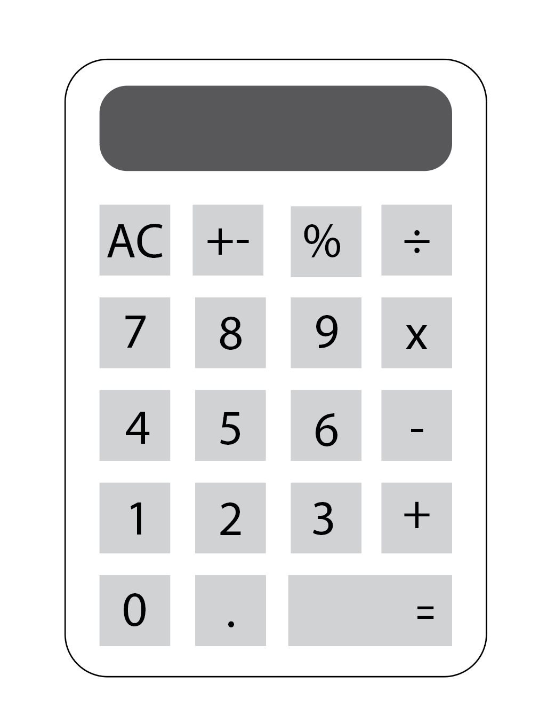

# React Calculator

This is a calculator app created with React.

## Planning

### Features:

- add, substract, multiply, divide
- decimal values, calculate percetages
- invert values, reset functionality
- format larger numbers, output resize based on length

### Wireframe:
- Layout.

- Components: It has 4 components. 
    - Wrapper
    - ButtonBox
    - Screen
    - Button
- Colors.

### Deployment

You can find a running version of this calculator here: [DEMO](https://charming-empanada-f8d3d4.netlify.app/)

## Resources
- [React Docs](https://reactjs.org/docs/jsx-in-depth.html) - Used React documentation to review basic syntax.
- [CSS Grid Layout Module](https://www.w3schools.com/css/css_grid.asp) - Reviewing for layout system.
- [Stack Overflow](https://stackoverflow.com/questions/71830754/npm-err-code-eresolve-npm-err-eresolve-unable-to-resolve-dependency-tree-in-re) - Used this snipped to fix conflict between installing "textfit" and the npx create - react - app modules. 
- [Mozilla Developer Network](https://developer.mozilla.org/en-US/docs/Web/JavaScript/Reference/Global_Objects/Array/flat) - Checked on array concatenation method flat().
- [npm dependancy issues for deployment netlify](https://stackoverflow.com/questions/66239691/what-does-npm-install-legacy-peer-deps-do-exactly-when-is-it-recommended-wh) - Used this solve deployment issues with dependency modules.
- [Failed during stage 'building site' netlify](https://stackoverflow.com/questions/64468843/netlify-deployment-failed-during-stage-building-site-build-script-returned-n) - Used this to solved deployment issue in Netlify.